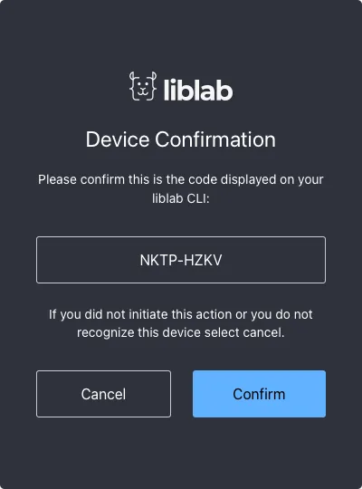
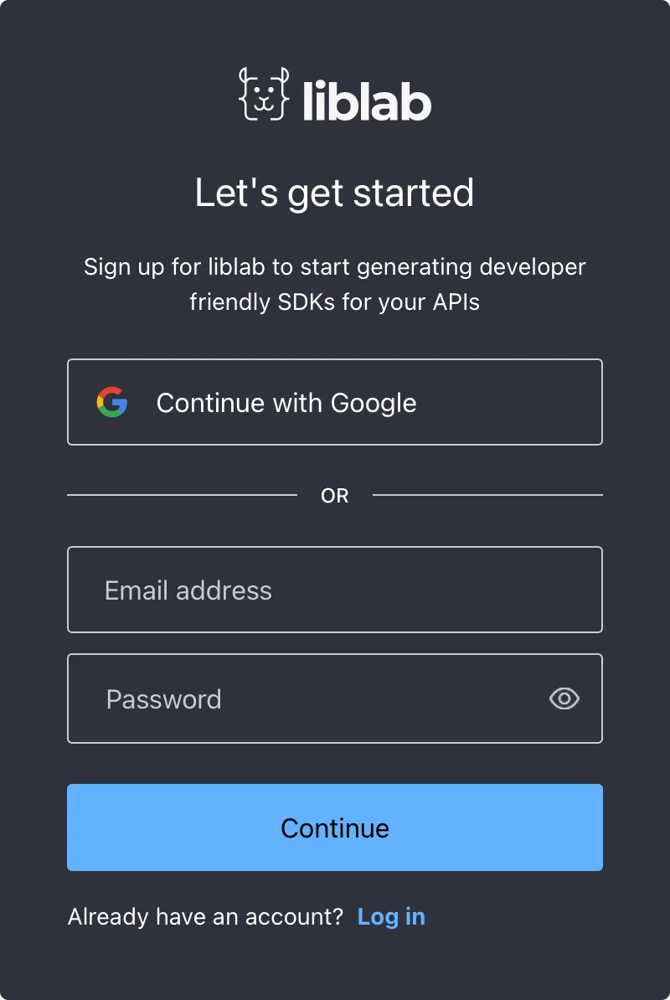
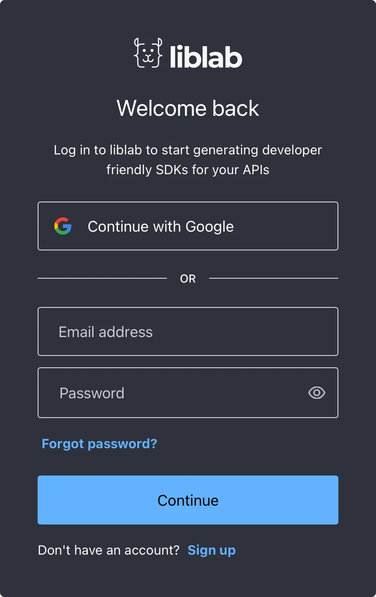
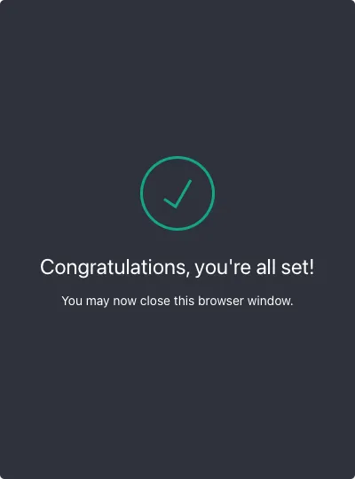
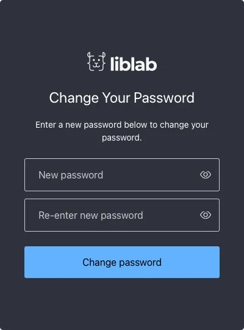

import GetStartedBlock from "../../../src/components/GetStartedBlock.tsx"

# Authentication

The authentication commands allow you to register, log in, log out, and reset your password, as well as create tokens for CI/CD.

<GetStartedBlock text="If you don't already have an account, sign up now to get started with liblab for free." secText="If your organization already has an account, talk to your liblab administrator to get an invite to join your organization." />

| Command                                                        | Description                                              |
| -------------------------------------------------------------- | -------------------------------------------------------- |
| <a href="#liblab-login">`liblab login`</a>                     | Log in to your account                                   |
| <a href="#liblab-logout">`liblab logout`</a>                   | Log out of your account                                  |
| <a href="#liblab-change-password">`liblab change-password`</a> | Change your password                                     |
| <a href="#liblab-token">`liblab token`</a>                     | Create a long-lived token to be used in a CI/CD pipeline |

## `liblab login`

Register a new account, or Log in to an existing account.

```bash

liblab login
```

This will launch your default browser where you can register or log in, either using your email address and password, or using a Google account. If you are part of an organization that has a liblab account, then your email address, or the email address for your Google account, must match that organization.

:::note
Verify with your liblab administrator what your preferred login method is. You can learn more about signing up, and the different roles in an organization in our <a href="">sign up guide</a>.
:::
The CLI will provide you with a code, and you will need to verify that this code matches the one shown in your browser:

```bash

A browser will now open, confirm the code and login
The confirmation code is NKTP-HZKV
If you have any issues you may also use the link: https://auth.liblab.com/activate?user_code=NKTP-HZKV
Waiting for confirmation and login at browser... ⣽
```

This output will also contain a browser link that you can use if your browser does not open automatically, or if you want to use a different browser, or different browser profile.



Once you have verified the code on screen matches the one given by the CLI, select Confirm, then sign up or log in.

<div className="auth-box">
<div>
The sign up dialog

</div>
<div>
The log in dialog

</div>
</div>

From the log in screen, you can also reset your password if you need to. Your browser should remember your login details, so if you log in again from the CLI, you will be automatically logged in once you have confirmed th device code.

Once you are successfully registered or logged in, you will get a confirmation message.



You can now close your browser window and return to the CLI, which will now be logged in.

```bash
Logged in successfully with account: no-one@example.com
```

You will also be sent an email to verify your account. You will need to select the Verify Your Account button in the email to verify your account. This email may take a few minutes to arrive, and may end up in your junk mail folders.

:::note
If you run other commands such as `liblab init` without logging in, you will be prompted to log in first.
:::

## `liblab logout`

Log out of your account.

```bash
liblab logout
```

This will log you out of your account. You will need to log in again to use the CLI.

```bash
User logged out successfully
```

## `liblab change-password`

This command allows you to change your password. It will launch your default browser where you can enter a new password.

```bash
liblab change-password
```



The CLI output will also contain a browser link that you can use if your browser does not open automatically, or if you want to use a different browser, or different browser profile.

```bash
A browser will now open where you can change your password
If you have any issues you may also use the link: https://auth.liblab.com/u/reset-password?ticket=****
You have been logged out. Please log in again.
```

Once you run this command, you will be logged out of the CLI, and will need to log in again once you have changed your password.

## `liblab token`

Create a long-lived token. Long lived tokens allow you to use the CLI without logging in, such as in a CI/CD pipeline.

```bash
liblab token [create/revoke/list]
```

:::note
Tokens give access to a limited set of CLI commands. You can use a token to validate a spec, build and SDK, and generate a PR, but you cannot run authentication commands. For example, you cannot change your password when you are authenticated using a token, as a token doesn't have a separate password. You also cannot create or revoke tokens when you are authenticated using a token.
:::

### Commands

| Command                        | Description                          |
| ------------------------------ | ------------------------------------ |
| <a href="">`create <name>`</a> | Create a new named long lived token. |
| <a href="">`revoke <name>`</a> | Revoke a long lived token.           |
| <a href="">`list`</a>          | List all long lived tokens.          |

#### `liblab token create`

This command creates a new long lived token with the given name.

```bash
liblab token create <name>
```

Set `<name>` to the name for your token. For example, to create a token for a GitHub Action called `LIBLAB_GITHUB_TOKEN`, run:

```bash
liblab token create LIBLAB_GITHUB_TOKEN
```

When you run this command, you will need to log in again to confirm your identity.

```bash
$ liblab token create LIBLAB_GITHUB_TOKEN
Token successfully generated, it will be valid for 90 days

-TOKEN-----------------------------------------
liblab_WoVBcuKKvwIGw2-EBjGHRjJdAJ46qggy8caFiqSP
-----------------------------------------------
```

The token is just the string between the `-TOKEN-` and `-------` lines. You do not need to include the lines themselves.

You will need to copy the token and store it somewhere safe. It will only be shown once, and you will not be able to retrieve it again. If you lose this token, you can revoke it using <a href="">`liblab token revoke <name>`</a>, and create a new one.

These tokens last 90 days by default, so you will need to generate a new token before this time. You can change this from 1 to up to 364 days using the optional `--durationInDays` parameter. You also can generate multiple tokens, all with different names.

To use this token, set an environment variable called `LIBLAB_TOKEN` to the value of this token. You can then use the CLI without logging in, such as in a CI/CD pipeline.

```bash
export LIBLAB_TOKEN=<token>
liblab build
```

:::note
If your token is not working, make sure you have just included the token itself, and not the surrounding `-TOKEN---` and `-------` lines.
:::

> For an example of using a token in a GitHub Action, check out our <a href="">GitHub Actions tutorial</a>.

##### Optional parameters

| Parameter             | Description                                                                               |
| --------------------- | ----------------------------------------------------------------------------------------- |
| `--durationInDays -d` | The lifespan of the token from 1 to 364 days. If this is not set, the default is 90 days. |

#### `liblab token revoke`

This command revokes the long lived token with the given name.

```bash
liblab token revoke <name>
```

For example, to revoke the `LIBLAB_GITHUB_TOKEN` token:

```bash
liblab token revoke LIBLAB_GITHUB_TOKEN
```

This will revoke the token immediately.

```bash
Token revoked successfully
```

#### `liblab token list`

This command lists all long lived tokens that you have created.

```bash
liblab token list
```

This will output a list of all the tokens you have created. You will only see the tokens by name, not the actual value of the token.

```bash
Here are all of your active tokens
- LIBLAB_GITHUB_TOKEN
- LIBLAB_JENKINS_TOKEN
```
