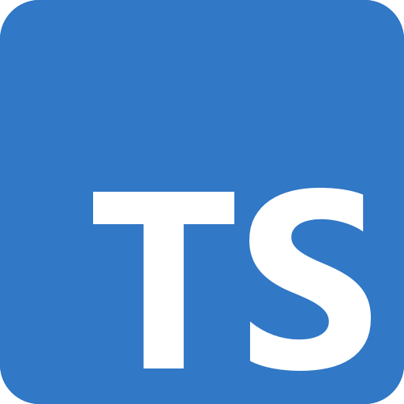
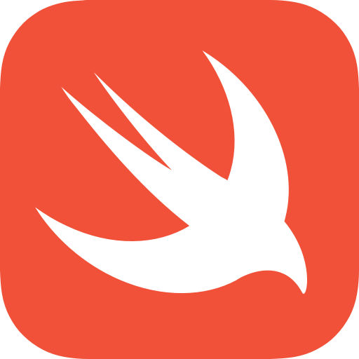
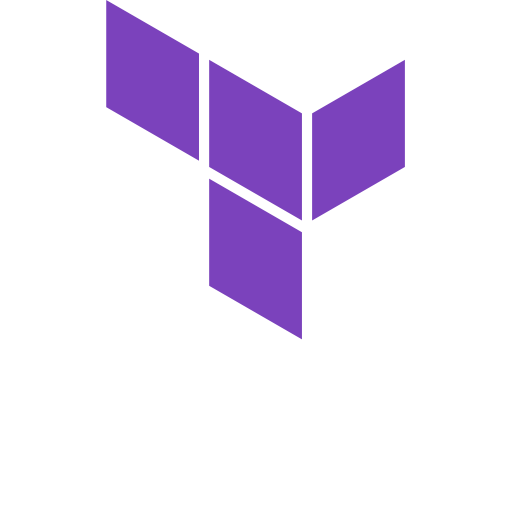

# Welcome to LibLab

<div className="command-block">
  <h2>Build developer friendly SDKs in minutes from your APIs</h2>

```bash

# Install liblab
npm install -g liblab
# login
liblab login
# Create your config file
liblab init --spec https://petstore.swagger.io/v2/swagger.json
# Generate your SDK
liblab build
```

<a className="learn-more" href="get-started/getting-started">Learn More</a>

</div>

<div className="command-block">
<h2>Generate SDKs in multiple languages, as well as Terraform providers</h2>
<div className="images-container">






</div>

<div className="sdk-box">
  <a className="learn-more" href="get-started/getting-started">Learn More</a>
  <p className="sdk-language">Some SDK languages are in beta. Check our <span>SDK language support reference guide</span> for details</p>
</div>

</div>

<div className="command-block">
<h2>Tutorials</h2>
<div className="tutorial-box">
<div className="tutorial"> 
<h3>End-to-end SDK generation and publishing with GitHub Actions</h3>
<p>Automatically generate your SDK every time your API changes using GitHub Actions.</p>
<a href="">Go</a>
</div>
<div className="tutorial">
<h3>Build a retrieval augmented generation (RAG) AI app using SDKs</h3>
<p>Learn how to add RAG to your apps using Semantic Kernel and C# SDKs.</p>
<a href="">Go</a>
</div>
<div className="tutorial">
<h3>Integrate SDK Snippets into your API Reference Documentation using Docusaurus</h3>
<p>Learn how to add SDK documentation to an existing Docusaurus documentation site.</p>
<a href="">Go</a>
</div>
<div className="tutorial">
<h3>Customize your SDK with hooks</h3>
<p>Learn how to customize your SDK with hooks.</p>
<a href="">Go</a>
</div>
<div className="tutorial">
<h3>liblab llama SDK challenge 🦙</h3>
<p>Learn how to build an SDK to control a llama in a game.</p>
<a href="">Go</a>
</div>
</div>

</div>

<div className="command-block">
<h2>Manage your account and SDKs with the liblab portal</h2>
<div className="dashboard-layer"></div>
 <a className="learn-more" href="get-started/getting-started">Learn More</a>
</div>

<div className="command-block yt-channel">
<iframe width="905" height="509" src="https://www.youtube.com/embed/fCW44itE4kw" title="What is liblab? liblab generates developer friendly, human readable SDKs from your APIs. 🦙" frameborder="0" allow="accelerometer; autoplay; clipboard-write; encrypted-media; gyroscope; picture-in-picture; web-share" referrerpolicy="strict-origin-when-cross-origin" allowfullscreen></iframe>

<p>Discover more video tutorials on our <span>YouTube channel</span></p>
</div>

  <h2>Support</h2>
  <p>Have questions? Get in touch!</p>
<div className="contact-box">
<div className="command-block">
<div className="img-block">

<span>Join our Discord</span>
  
</div>
<p className="join">Join our community and ask questions on our <a href="https://discord.gg/F8aECHbRkV" target="_blank">Discord server</a>.</p>
</div>
<div className="command-block">

<div className="img-block">

<span>Contact Us</span>
  
</div>
<p className="join">Have questions? Contact us via our <a href="https://discord.gg/F8aECHbRkV" target="_blank">contact form</a>.</p>
</div>
</div>
